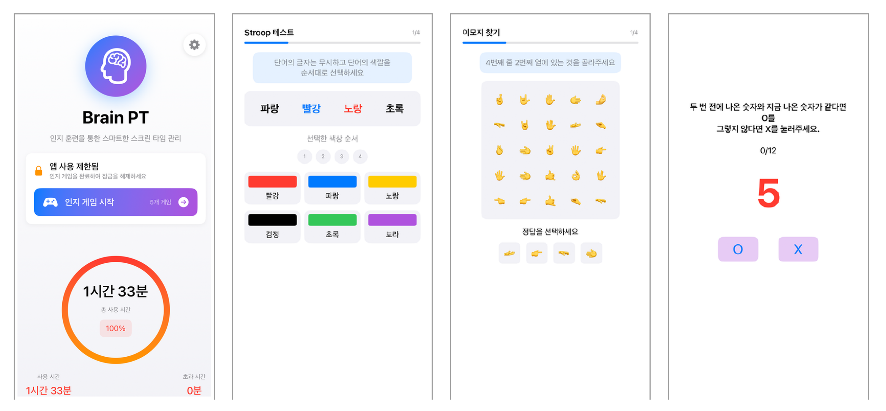
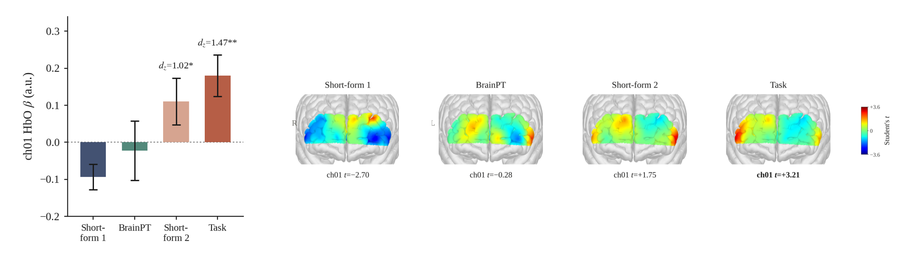
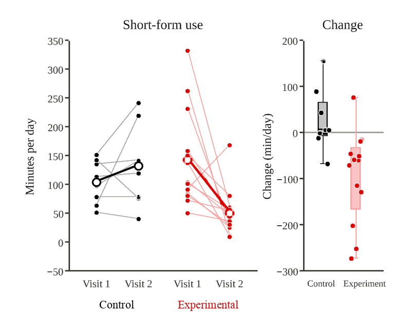
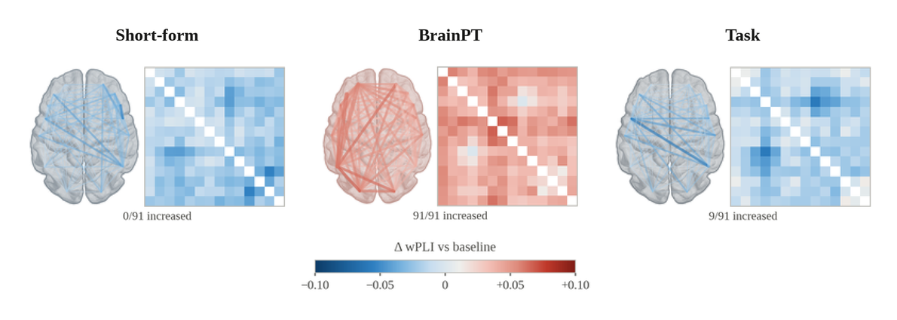
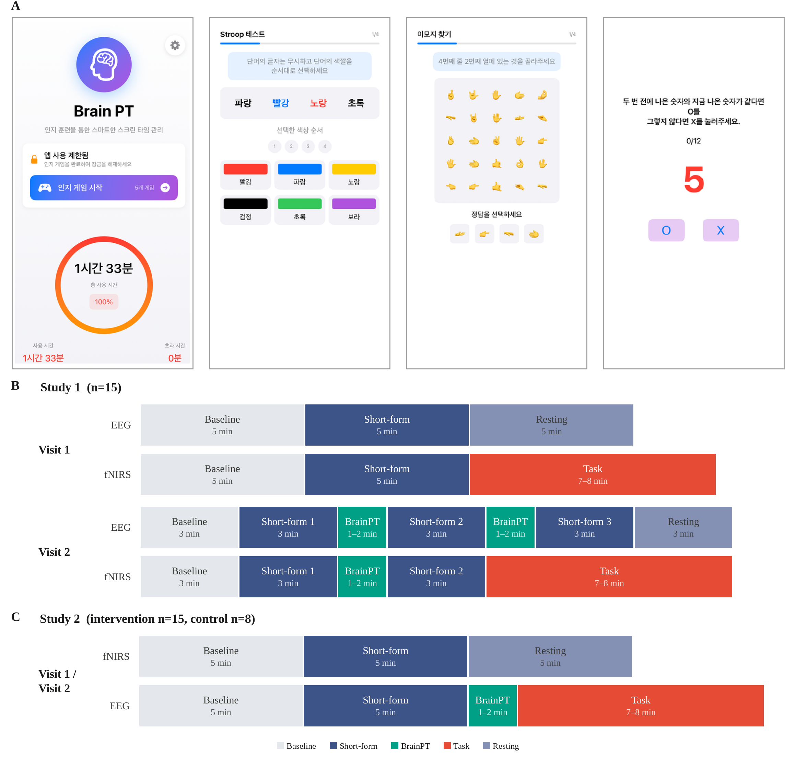
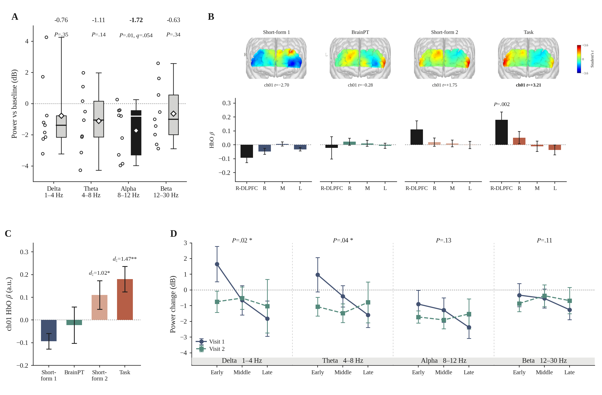
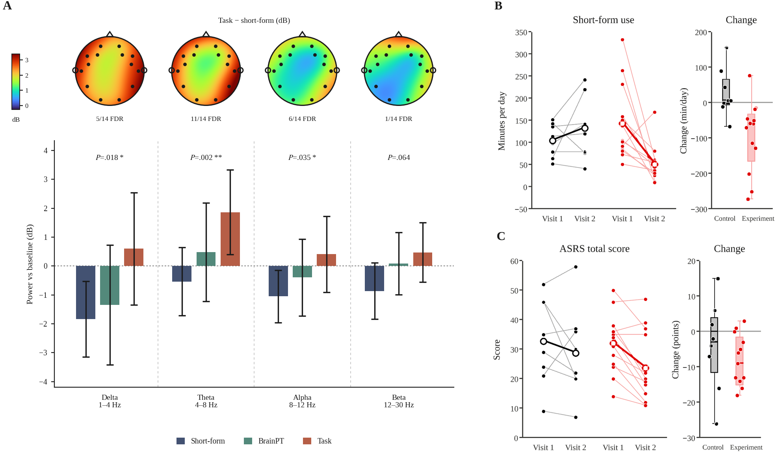
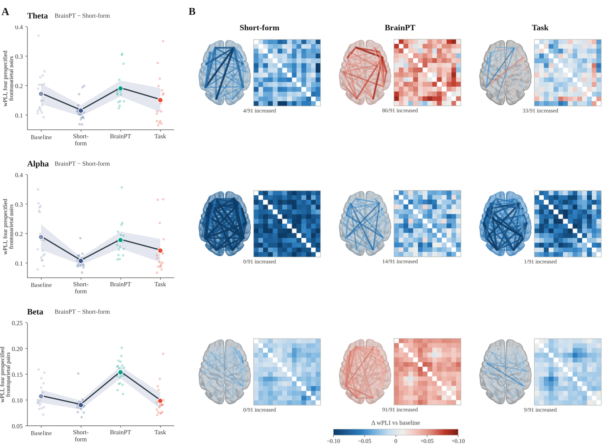

# BrainPT

**BrainPT, a Cognitive Mini-Game App for Short-Form Video Use in Young Adults: Neural and Behavioral Pilot Study**

Yunjeong Jeong, Chaewon Kim, Sungmin Ha, Seoyoung Choi, Sanghoon Han
Department of Psychology, Yonsei University, Seoul, Republic of Korea

This repository contains the analysis code for the paper. Participant data are not included.

<p align="center">
  
  <br>
  <sub>The BrainPT app (Korean interface): the home screen after the daily short-form threshold is reached, and three of the ten cognitive tasks.</sub>
</p>

## Overview

Interventions for short-form video use usually target time of use. BrainPT instead treats viewing as a **neural state** and targets that state directly. When daily Instagram + YouTube use reaches 30 minutes, the iOS app launches and presents a short set of cognitive tasks (five of ten, in formats borrowed from the Comprehensive Attention Test). Viewing is interrupted, not blocked.

| | Study 1 | Study 2 |
|---|---|---|
| Question | Does a single insertion change the neural state during viewing? | Does 2 weeks of repeated use change behavior? |
| Design | Within-subject, two lab visits | Nonrandomized pretest-posttest, experimental vs control |
| Sample | n = 9 | Behavioral 13 vs 8; EEG 10 vs 8 |
| Measures | EEG (Emotiv EPOC X, 14 ch) + fNIRS (NIRSIT LITE) | Same, plus daily short-form use, ASRS, app logs |

## Main findings

### Study 1: a single insertion moves the prefrontal state

During short-form viewing, right dorsolateral prefrontal activation (fNIRS ch01, BA46) fell below rest, the opposite of goal-directed tasks (−0.093 vs +0.180, P=.002). The viewing block immediately after a BrainPT insertion rose above rest (+0.110 vs −0.093, P=.02). EEG power was also below baseline in all four bands, most in alpha (−1.72 dB).

<p align="center">
  
  <br>
  <sub>Study 1, visit 2 (n=9). Left: HbO β at ch01 for each block in session order. Right: prefrontal HbO maps (Student t against baseline); red is above rest.</sub>
</p>

### Study 2: daily short-form use fell after 2 weeks

Daily short-form use fell from 143.5 to 50.9 min in the experimental group and rose from 104.8 to 132.9 min in the control group (difference in change −120.7 min, 95% CI −197.4 to −43.9, P=.004, d=−1.35). ASRS total did not differ between groups (P=.39), and no neural index separated the groups after 2 weeks.

<p align="center">
  
  <br>
  <sub>Daily short-form viewing time before and after 2 weeks. Thin lines are participants, open circles group means; right, per-participant change.</sub>
</p>

The Study 1 condition ordering (short-form < BrainPT < task) replicated in an independent preintervention sample (n=18), where BrainPT also raised beta coupling across the scalp:

<p align="center">
  
  <br>
  <sub>Study 2 visit 1 (preintervention, n=18). Change in beta-band weighted phase lag index relative to baseline across all 91 channel pairs. Sensor space, not source estimates.</sub>
</p>

All analyses are exploratory and were not preregistered; Study 2 is nonrandomized and its primary outcome is self-reported.

<details>
<summary><b>Full figures from the paper</b></summary>

**Figure 1.** The BrainPT app and the experimental procedure.


**Figure 2.** The neural state during short-form viewing and the effect of the inserted intervention (Study 1, n=9).


**Figure 3.** Neural state by condition and behavioral change after 2 weeks in Study 2.


**Figure 4.** Scalp coupling by condition (Study 2 visit 1, n=18; cognitive task n=17).


</details>

## Repository structure

```
common/
  eeg/      eeg_pipeline.py        EEG preprocessing (filter, bad channels, ICA/ICLabel, band power, dB)
            wpli_analysis.py       weighted phase lag index
            entropy_metrics.py     signal entropy
            cfc_metrics.py         cross-frequency coupling
            csv_loader.py          loader for EmotivPRO CSV exports
            reproduce_eeg.py       recomputes reported EEG values and checks them
            lord_tost_eeg.py       change-score vs ANCOVA agreement, equivalence tests
  fnirs/    fnirs_statistics.py    Study 1 contrasts, Study 2 carry-over
            reproduce_fnirs.py     recomputes reported fNIRS values and checks them
            lord_tost_fnirs.py     change-score vs ANCOVA agreement, equivalence tests
study1/
  behavior/ bart_preprocessing.ipynb
  brain/    aperiodic_analysis.py      aperiodic (FOOOF) control analysis
            f4_cluster_correction.py   F4 0.5 Hz spectrum, cluster correction
            f4_null_variants.py        sensitivity of the cluster P to the null model
study2/
  behavior/ study2.ipynb               main behavioral analysis
            daily_selfreport.py        daily self-report descriptives
            src/study2_utils.py        group assignment and test helpers
            firebase/                  app-log export and session tagging
  brain/    study2_split.py            block thirds for the time-course analysis
            study2_extra.py            additional block metrics
            full_conn.py               all-pair connectivity
            reconstructed_conn372_*.py exploratory 372-test connectivity analysis
figures/                               images used in this README
```

## Where each result is computed

| Result | Paper figure | Script |
|---|---|---|
| Study 1 band power during viewing | 2A | `common/eeg/reproduce_eeg.py` |
| Study 1 fNIRS ch01 contrasts | 2B, 2C | `common/fnirs/fnirs_statistics.py` |
| Study 1 time course across viewing segments | 2D | `common/eeg/reproduce_eeg.py` |
| F4 spectrum cluster correction | | `study1/brain/f4_cluster_correction.py` |
| Aperiodic control analysis | | `study1/brain/aperiodic_analysis.py` |
| Study 2 band power by condition (visit 1) | 3A | `common/eeg/reproduce_eeg.py` |
| Daily short-form use, ASRS | 3B, 3C | `study2/behavior/study2.ipynb` |
| Frontoparietal and all-pair coupling | 4 | `common/eeg/reproduce_eeg.py` |
| Neural carry-over, equivalence tests | | `common/eeg/lord_tost_eeg.py`, `common/fnirs/lord_tost_fnirs.py` |
| Exploratory 372-test connectivity | | `study2/brain/reconstructed_conn372_checks.py` |

## Running the code

```bash
pip install -r requirements.txt
cd common/eeg && python reproduce_eeg.py
```

Each script resolves `data/` relative to its own location; run it from its folder. The statistics scripts need only numpy, scipy and pandas. Preprocessing from raw EDF (`common/eeg/eeg_pipeline.py`) additionally needs mne, pyprep, mne-icalabel and torch.

### Expected data layout

Data are available from the corresponding author on reasonable request. The scripts expect:

```
data/
  study1/  behavior/  markers/  preprocessed/  quantified/  neural/
  study2/  behavior/  markers/  preprocessed/  quantified/  neural/
```

Participants are identified as `S1-nn` and `S2-nn`.

## Reproducibility notes

- **Bad-channel cap.** When more than half the channels are flagged, the pipeline keeps three of them via `list(set(bads))[:3]`. Set order depends on Python's hash seed, so the interpolated channels, and the resulting band power, vary between runs for recordings where the cap fires. Recordings where it does not fire reproduce exactly. The ordering short-form < BrainPT < task held in every re-run.
- **Band edges** are inclusive at both ends, so the 4, 8 and 12 Hz bins count toward two bands.
- The exploratory 372-test connectivity scripts rebuild the index definitions from the reported numbers; the original script was not preserved.

## Citation

> Jeong Y, Kim C, Ha S, Choi S, Han S. BrainPT, a cognitive mini-game app for short-form video use in young adults: neural and behavioral pilot study. *[journal, year — to be added]*.

## Ethics

Approved by the Institutional Review Board of the Department of Psychology, Yonsei University (7001988-202509-HR-2369-04).
